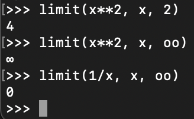
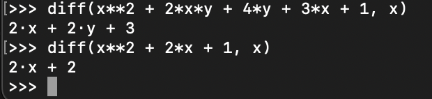
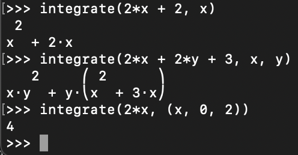
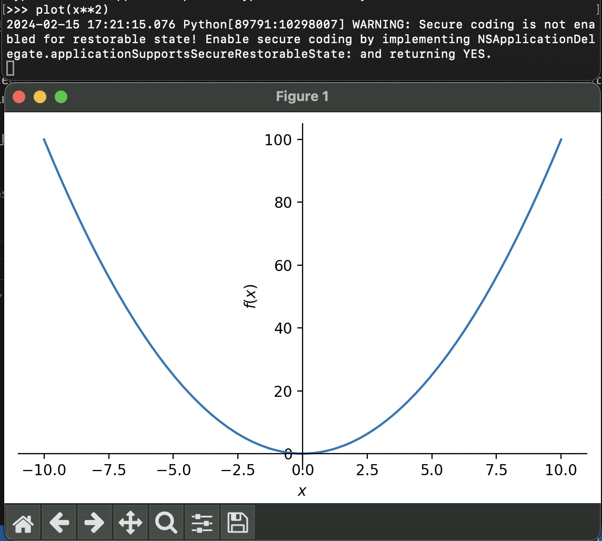

# About the library
## The library used
The library selected for this project is SymPy.
## About SymPy
SymPy allows for symbolic mathematics in Python. It is able to do simplification, mathematical functions (such as sin, cos, and log), calculus based mathematics as well as linear algebra. It can also plot single variable functions through matplotlib.

It was started in 2005 by Ondřej Čertík and has evolved into an open-source project with many contributors.

## Reason for selection
The reason this library was selected was for its ability to process symbolic mathematics. This is able to expand Python's capability into aiding fields such as Physics and Engineering to process more complex functions in their programs, which was something I was interested in exploring. The program created helps Engineering by being able to easily process signals using Fourier Series, which requires integration.

Using this library complemented my Python skills and allowed me to build a more practical program with it using this library.

## Overall Experience
It was quite easy to learn this library. Most actions are simple Python functions which are straightforward to use. The documentation is very well written and described everything about the library.

The only difficult part was entering piecewise functions. They are written weird and breaks Python's syntax for logic statements.

Overall, I would recommend this to anyone in the field of Physics or Engineering who needs to process complex functions. The syntax is straightforward and is able to perform calculations very well. I personally would continue to use this package for the same reasons.

## Functionalities
This library is able to perform many calculus functions.

### Limits
The `limit()` function allows for processing limits. The arguments are passed as function, variable, and value. It can process regular limits as well as limits to infinity, which is written as `oo`.

### Differentiation
The `diff()` function allows for differentiation. It can do single variable differentiation as well as partial differentiation of multivariable functions. The arguments are passed as function and variable.

### Integration
The `integrate()` function allows for integration. It can do single variable integration as well as double or triple integrals. The arguments vary depending on the type of integration being performed.

### Plotting
The `plot()` function allows for functions to be plotted using matplotlib. The arguments passed are just the function. A new window is opened to show the graph.

