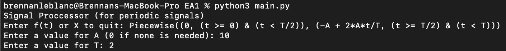
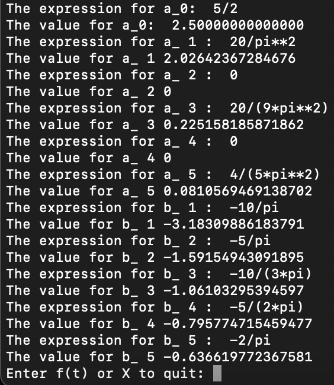

# Signal Processor (for periodic signals)

This program allows you to calculate Rectangular Fourier Coefficients in use for signal analysis. The coefficients are integrated from 0 to T for some periodic signal.

The a0 coefficient, a1 - a5 coefficients and b1 - b5 coefficients are printed as both an expression and a numerical value.

All calculations are done through the Python library SymPy. The variables that may be used in expressions are A, T, and t.

## Usage

The program is started by invoking `python3 main.py`

Functions can be entered as a mathematical formula, with variables being allowed. Piecewise functions may also be entered (see Test Case 2). The function must follow SymPy's syntax for expressions (which, for the most part, is just Python's syntax). You are then prompted to enter your choice of A and T. Afterwards, your coefficients will be calculated.

Multiple functions may be calculated in one session. When you are ready to stop, enter "X"

## Test Cases

### Test Case 1

For this function, which is f(t) = -2At/T + A, we will use A = 5 and T = 4.

This is entered into the program as follows:

Which gives us the resulting output:

### Test Case 2

For this function, we have a piecewise function, denoted as follows. We will also use a value of A = 10 and T = 2

$$
f(t)
= 
\begin{cases}
0 \text{ if } 0 \leqslant t < \frac{T}{2}\\
\frac{2A}{T}t - A \text{ if } \frac{T}{2} \leqslant t < T
\end{cases}
$$

Now, for it to be recognized, we must use the `Piecewise()` function during our input. Each piece, passed as an argument to the `Piecewise()` function, will follow the format `(value, cond)`. Conditions must writin like logic statements, with "and" represented as `&` and "or" represented as `|`.

To enter this in the program, we will do it as follows:

Which gives us the resulting output:

